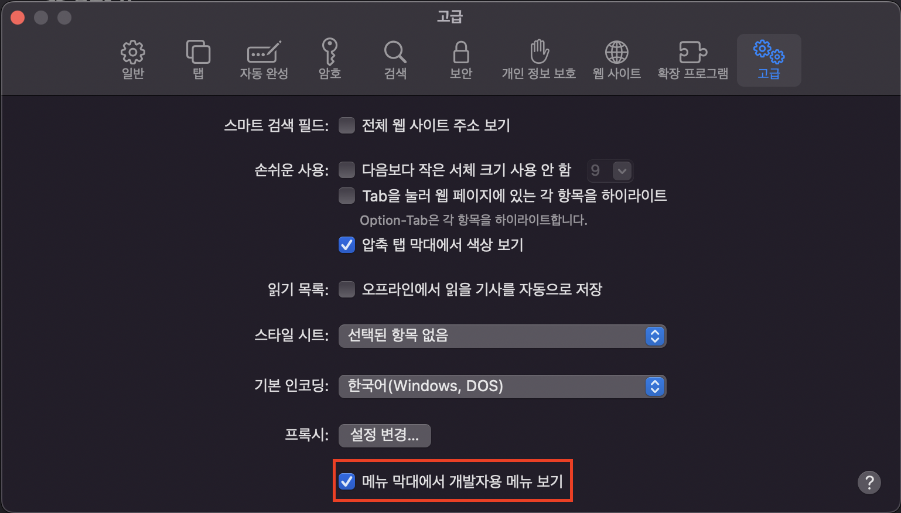

1. web 소스 로컬 서버로 돌린다. (예시: localhost:3001)
2. app 소스에서 WebView 컴포넌트에 props로 넘기는 uri 를 맥북에 연결된 네트워크와 같은 것으로 바꿈
   (예시: http://<hi1>10.10.100.100:3001)

   - 맥북에 연결된 네트워크 확인하는 법
     - 오른쪽 상단 시계 왼편 와이파이 클릭 > 제일 아래 '네트워크 환경설정' 클릭
     - 'WI-FI가 ~ 에 연결되었고 IP 주소는 10.10.100.100 입니다.' 에서 확인

3. app 프로젝트 루트에서 yarn ios 입력하면 iOS 시뮬레이터 켜짐
4. 사파리 실행 > 상단 메뉴 중 '개발자용' > 시뮬레이터 > 10.10.100.100 네트워크 선택

   - 상단 메뉴에서 개발자용 보이지 않을 때

     - 사파리 실행 > `cmd + ,` 입력 (혹은 메뉴 막대에서 사과 오른편 safari 클릭 후 환경설정) > 고급 > `메뉴 막대에서 개발자용 메뉴 보기` 체크

       

5. web 소스의 console.log 가 사파리 콘솔에서 보임
