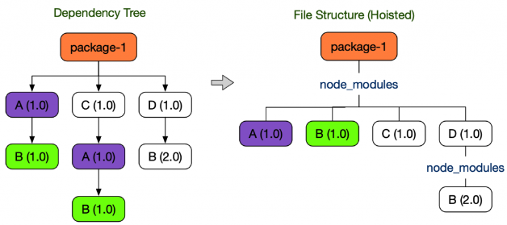

## NPM 과 Yarn(v1)

npm과 yarn은 같이 자바스크립트 런타임 환경인 노드(Node.js)의 패키지 관리자이다. 전세계의 개발자들이 자바스크립트로 만든 다양한 패키지를 npmjs 에 올리면 npm, yarn 과 같은 패키지 관리자를 통해 설치 및 삭제가 가능하다. 그리고 명령줄 인터페이스 (Command-line interface, CLI)를 통해 패키지 설치 및 삭제 뿐 아니라 패키지 버전 관리, 의존성 관리도 편리하게 가능하다.

### NPM

npm 은 노드 패키지 매니저 (Node Package Manager)의 줄임말로 노드를 설치할 때 자동으로 설치되는 기본 패키지 관리자이다.

### Yarn

yarn 은 2016년 페이스북에서 개발한 패키지 관리자이다. 리액트(React)와 같은 프로젝트를 진행하며 겪었던 어려움을 해결하기 위해 개발되었고, npm 레지스트리와 호환하면서 속도나 안정성 측면에서 npm 보다 향상되었다.

### NPM과 Yarn의 차이점

### 속도

- npm : 패키지를 한 번에 하나씩 순차적으로 설치
- yarn : 여러 패키지를 동시에 가져오고 설치하도록 최적화 되어 있어 npm 보다 빠름

### 보안

- npm : 자동으로 패키지에 포함된 다른 패키지 코드를 실행 → 보안 시스템에 몇가지 취약성 발생 가능
- yarn : yarn.lock 또는 package.json 파일에 있는 파일만 설치하여 npm 보다 더 안전함
  (그러나 최신 npm 업데이트에서 보안 성능도 크게 향상 되었다고 함)

## NPM 및 Yarn (v1)의 문제점

### 유령 의존성 (phantom dependency)

간단히 말하면 직접 설치하지 않은 라이브러리를 사용할 수 있게 되는 현상이다. npm 및 yarn v1에서는 중복해서 설치되는 node_modules 를 아끼기 위해 끌어올리는 (Hoisting) 기법을 사용한다.



의존성 트리가 왼쪽의 모습을 하고 있을 때, 왼쪽 트리에서 _A (1.0)_ 과 _B (1.0)_ 패키지는 두 번 설치되므로 디스크 공간을 낭비한다. npm 과 yarn v1 에서는 디스크 공간을 아끼기 위해 원래 트리의 모양을 오른쪽 트리처럼 바꾼다.
오른쪽 트리로 의존성 트리가 바뀌면서 package-1 에서는 원래 import 할 수 없었던 B (1.0) 라이브러리를 불러올 수 있게 되었다.

실제 코드 작성할 때의 예로 들면, `immer` 라이브러리를 따로 설치하지 않았을 때, 프로젝트 루트에 있는 package.json 에서 immer를 검색하면 매치되는 결과가 없지만 yarn.lock 파일에서 검색하면 몇 개가 나오는데 이는 다른 라이브러리의 패키지에 포함되어 있기 때문이다.
따라서 유령 의존성 현상이 발생해 immer 라이브러리를 직접 설치하지 않았지만 코드 내에서 사용할 수 있게 된다. 이 때 사용은 import 문을 통째로 복붙 하게 되면 사용 가능하다.

반대로 immer의 의존성 라이브러리를 삭제하게 되면 immer 사용도 불가해져 사용 중인 곳에서 에러가 발생할 수도 있는 문제가 있다.

```tsx
// 아래 import 라인을 통째로 먼저 복붙 하게 되면 코드 내에서 import 한 메소드를 사용 했을 때, 에러가 발생하지 않음
import { setAutoFreeze } from 'immer';

const Component = () => {
	...

	const test = () => {
		setAutoFreeze(true); // module not found 등 별다른 에러가 발생하지 않음
	}
	...
}
```

참고
[npm과-yarn의-차이점](https://joshua1988.github.io/vue-camp/package-manager/npm-vs-yarn.html#npm%E1%84%80%E1%85%AA-yarn%E1%84%8B%E1%85%B4-%E1%84%8E%E1%85%A1%E1%84%8B%E1%85%B5%E1%84%8C%E1%85%A5%E1%86%B7)
