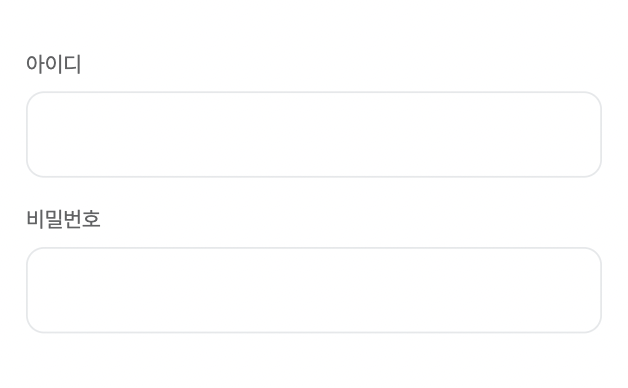

회사에서 리뉴얼 하는 프로젝트에 거의 모든 페이지에서 input을 입력 받고 form 요청을 하게 되었다. 그래서 효율적인 폼 관리를 위하여 `react-hook-form` 라이브러리를 사용하게 됐는데, 회사 프로젝트에 사용할 공통 컴포넌트도 직접 만들고 있어서 input 컴포넌트와 라이브러리를 같이 사용하는 법을 공식 문서를 보고 연습해보았다.

먼저 text input 공통 컴포넌트를 만들어 보았다.

```
import styled from '@emotion/styled';
import { theme } from 'assets/styles';
import { Typography } from 'components/Typography';
import React from 'react';

interface Props extends React.InputHTMLAttributes<HTMLInputElement> {
  label: string;
  errorMessage?: string;
  suffix?: React.ReactNode;
}

const Container = styled.div`
  display: flex;
  flex-direction: column;
`;

const InputWrapper = styled.div`
  position: relative;
  width: 100%;
  ${theme.flex('', 'center', '')};
`;

const SuffixWrapper = styled.div`
  padding-right: 16px;
`;

const StyledInput = styled.input<{ hasError?: boolean }>`
  width: 100%;
  height: 48px;
  padding: 12px 4px 12px 16px;
  outline: none;
  border: none;
  background: none;
  caret-color: ${theme.color.primary};

  &::placeholder {
    color: ${theme.color.gray4};
    font-size: 1.4rem;
  }

  /** 상태에 따른 border style 적용을 위한 빈 태그  */
  & + div {
    position: absolute;
    width: 100%;
    height: 100%;
    pointer-events: none;
    border-width: 1px;
    border-style: solid;
    border-radius: 10px;
    border-color: ${({ hasError }) => (hasError ? theme.color.error : theme.color.gray5)};
  }

  &:focus {
    & + div {
      border-color: ${({ hasError }) => (hasError ? theme.color.error : theme.color.primary)};
    }
  }

  &:read-only {
    & + div {
      border-color: ${theme.color.gray6};
      background-color: ${theme.color.gray6};
    }
  }
`;

const StyledLabel = styled.label`
  margin-bottom: 8px;
  font-size: 12px;
  color: ${theme.color.gray2};
`;

const ErrorTextWrapper = styled.div`
  margin-top: 4px;
`;

const Input = React.forwardRef<HTMLInputElement, Props>(function Input({ id, label, suffix, errorMessage, ...props }, ref) {
  return (
    <Container>
      {label && id && <StyledLabel htmlFor={id}>{label}</StyledLabel>}

      <InputWrapper>
        <StyledInput id={id} ref={ref} hasError={!!errorMessage} {...props} />
        <div></div>
        <SuffixWrapper>{suffix}</SuffixWrapper>
      </InputWrapper>

      {errorMessage && (
        <ErrorTextWrapper>
          <Typography textColor="error" size="p3">
            {errorMessage}
          </Typography>
        </ErrorTextWrapper>
      )}
    </Container>
  );
});

export default Input;
```

만든 input 공통 컴포넌트 사용은 아래처럼 하면 된다.

```
import styled from '@emotion/styled';
import Input from 'components/Input';

const Container = styled.div`
  padding: 20px;
  > div {
    padding-top: 16px;
  }
`;

const Login = () => {
  return (
    <Container>
      <Input id="id" label="아이디" />
      <Input id="password" label="비밀번호" type="password" />
    </Container>
  );
};

export default Login;

```



로그인 요청을 보낼 때 사용자에게 입력 받은 아이디와 비밀번호를 요청 보내게 되는데, 아이디와 비밀번호 값과 요청 보낼 때 유효성 검사 등의 상태 등 관리해주어야 할 상태가 input 갯수에 비례하여 늘어나게 된다.

```
import styled from '@emotion/styled';
import Input from 'components/Input';
import { useCallback, useState } from 'react';

const Login = () => {
  const [id, setId] = useState('');
  const [password, setPassword] = useState('');

  const [idErrorMessage, setIdErrorMessage] = useState('');
  const [passwordErrorMessage, setPasswordErrorMessage] = useState('');

  const validateId = useCallback(() => {
    let isValid = false;
    if (!id) {
      setIdErrorMessage('아이디를 입력해주세요.');
    } else {
      isValid = true;
      setIdErrorMessage('');
    }
    return isValid;
  }, [id]);

  const validatePassword = useCallback(() => {
    let isValid = false;
    if (!password) {
      setPasswordErrorMessage('비밀번호를 입력해주세요.');
    } else {
      isValid = true;
      setPasswordErrorMessage('');
    }
    return isValid;
  }, [password]);

  const onSubmit = useCallback(
    (e: React.FormEvent) => {
      e.preventDefault();

      if (!!validateId() && !!validatePassword()) {
        setId('');
        setPassword('');
        console.log('로그인 api 요청', { id, password });
      }
    },
    [validateId, validatePassword, setId, setPassword],
  );

  return (
    <Container>
      <form onSubmit={onSubmit}>
        <Input id="id" label="아이디" value={id} onChange={e => setId(e.target.value)} errorMessage={idErrorMessage} />
        <Input
          id="password"
          label="비밀번호"
          type="password"
          value={password}
          onChange={e => setPassword(e.target.value)}
          errorMessage={passwordErrorMessage}
        />
        <div>
          <button>로그인</button>
        </div>
      </form>
    </Container>
  );
};

export default Login;

```

하지만 `react-hook-form` 라이브러리를 사용하게 되면 아래처럼만 사용하면 되어서 input 입력과 관련된 상태가 현저히 줄어들어 폼 관리 하기에 매우 효율적이다.
register 사용할 때

```
interface ILoginForm {
  id: string;
  password: string;
}

const Login = () => {
  const {
    register,
    setError,
    formState: { errors },
    reset,
    handleSubmit,
  } = useForm<ILoginForm>({ mode: 'onSubmit' });

  const onSubmit: SubmitHandler<ILoginForm> = data => {
    if (!!data.id && !!data.password) {
      reset({ id: '', password: '' });
      console.log('로그인 api 요청', data);
    }
  };

  return (
    <Container>
      <form onSubmit={handleSubmit(onSubmit)}>
        <Input id="id" label="아이디" {...register('id')} errorMessage={errors.id?.message ? errors.id?.message : undefined} />
        <Input
          id="password"
          label="비밀번호"
          type="password"
          {...register('password')}
          errorMessage={errors.password?.message ? errors.password?.message : undefined}
        />
        <div>
          <button>로그인</button>
        </div>
      </form>
    </Container>
  );

```

Controller 를 사용할 때

```
const { control, setValue, handleSubmit } = useForm<ILoginForm>({
    defaultValues: {
      id: '',
      password: '',
      switch: true,
    },
  });


const onSubmit: SubmitHandler<ILoginForm> = values => {
  console.log('SUCCESS: rules의 유효성 검사 에러 없이 통과 되면 호출', values);
};

const onError: SubmitErrorHandler<ILoginForm> = errors => {
  console.log('ERROR: rules의 유효성 검사에 걸리면 호출', errors);
};

return (
    <Container>
      <form noValidate onSubmit={handleSubmit(onSubmit, onError)}>
        <Controller
          name="id"
          control={control}
          rules={{
            required: '아이디를 입력해주세요',
          }}
          render={({ field, fieldState }) => (
            <Input
              id="id"
              label="아이디"
              placeholder="아이디입력"
              required
              handleReset={() => setValue('id', '')}
              errorMessage={fieldState.error ? fieldState.error.message : undefined}
              {...field}
            />
          )}
        />

        <Controller
          name="password"
          control={control}
          rules={{
            required: '비밀번호를 입력해주세요',
          }}
          render={({ field, fieldState }) => (
            <Input
              id="password"
              label="비밀번호"
              placeholder="비밀번호 입력"
              required
              type={`${showPassword ? 'text' : 'password'}`}
              errorMessage={fieldState.error ? fieldState.error.message : undefined}
              suffix={
                <button type="button" onClick={() => setShowPassword(!showPassword)}>
                  <Icon name={`${showPassword ? 'showOn' : 'showOff'}`} />
                </button>
              }
              {...field}
            />
          )}
        />

        <Controller
          name="switch"
          control={control}
          render={({ field }) => (
            <Switch
              id="switch"
              checked={field.value}
              label="토글 스위치"
              {...field}
              value="switch"
            />
          )}
        />

        <div>
          <button type="submit">로그인</button>
        </div>
      </form>
    </Container>
  );
```
