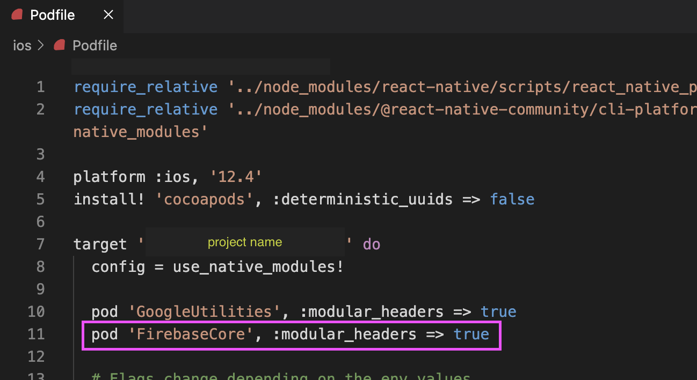

- React Native 버전 : `0.70.5`

1. fcm 푸시 알림을 구현하기 위해 react-native-firebase/app 과 react-native-firebase/messaging 을 설치를 해야 한다.

   - firebase/app 과 firebase/messaging 둘 다 16.5.0 버전 (현재 최신 버전)
   - <a href="https://github.com/invertase/react-native-firebase/blob/main/packages/messaging/CHANGELOG.md" target="_blank">참고</a>로 iOS foreground 일 때, 푸시 받을 수 있는 것은 firebase/messaging 15.2.0 버전부터 사용 가능 하다고 한다.

2. 두 개 패키지 설치하고 cd ios && pod install
3. cd .. && yarn ios 하니까 에러 발생;

   - <b>Module 'FirebaseCore' not found</b> 에러 발생
   - ios/Podfile 에 아래 코드 추가해주어야 한다고 함 <a href="https://github.com/invertase/react-native-firebase/discussions/6339" target="_blank">(참고)</a>  
     `pod 'FirebaseCore', :modular_headers => true`

     

4. 다시 yarn ios 하니까 됐다!
