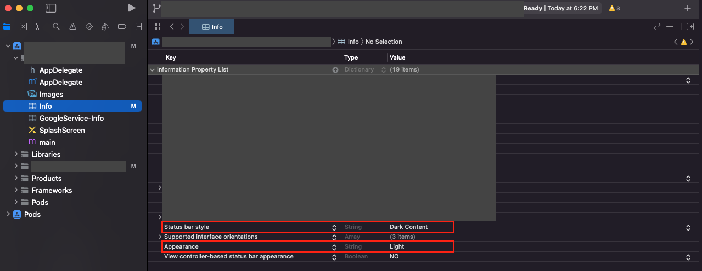

- React Native 버전은 `0.70.5`
- 방법

  - <b>info.plist</b> 에서 아래 코드를 복사하여 추가해준다.

    ```
    <key>UIStatusBarStyle</key>
    <string>UIStatusBarStyleDarkContent</string>

    <key>UIUserInterfaceStyle</key>
    <string>Light</string>
    ```

  - xcode > info 파일에서 직접 추가 해주면 위에서 직접 복붙한 코드가 자동으로 추가된다.

    - <b><i>Appearance</i></b> key가 코드에는 `<key>UIUserInterfaceStyle</key>` 로 들어감

      
