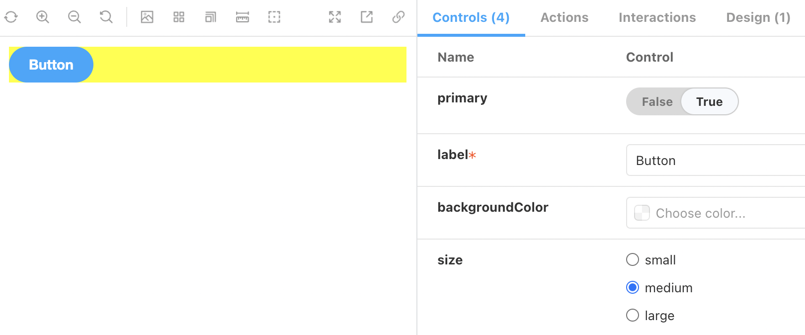
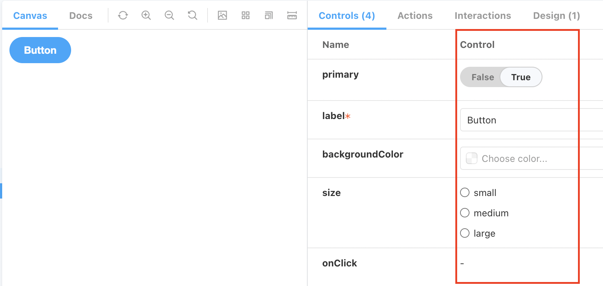
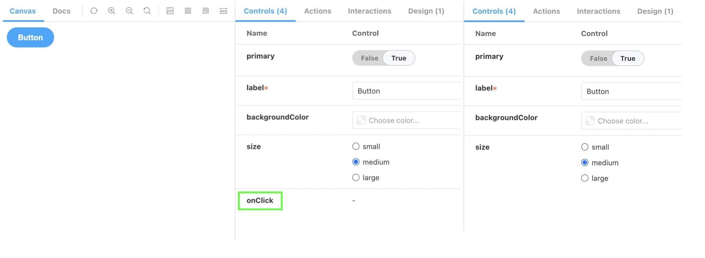

### decorator

프로젝트의 reset.css 를 storybook 에서도 적용되게 하려면 decorator 를 사용해서 전역 스타일을 줄 수 있다.
GlobalStyles 컴포넌트를 하나 만들어서 .storybook/preview.js 에서 전역적으로 주입해줄 수 있다.

```tsx
// GlobalStyles.tsx
import { css, Global } from '@emotion/react';

const GlobalStyles = () => (
  <Global
    styles={css`
      * {
        margin: 0;
        padding: 0;
        box-sizing: border-box;
      }

      html {
        font-size: 10px;
      }
    `}
  />
);

export default GlobalStyles;
```

```tsx
// .storybook/preview.js
import GlobalStyles from '../src/components/GlobalStyles';

export const decorators = [
  Story => (
    <>
      <GlobalStyles />
      <Story />
    </>
  ),
];
```

또한 스토리북에서 개별 컴포넌트에 스타일을 주고 싶을 때 해당 컴포넌트 스토리북 파일에서 decorator 로 넣어주면 된다.

```tsx
// Button.stories.tsx
import { ComponentMeta, ComponentStory } from '@storybook/react';
import { useEffect } from 'react';

import Button from '.';

export default {
  title: 'Components/Button',
  component: Button,
  // 배경 컬러 yellow 로 설정
  decorators: [
    Story => (
      <div style={{ backgroundColor: 'yellow' }}>
        <Story />
      </div>
    ),
  ],
} as ComponentMeta<typeof Button>;

const Template: ComponentStory<typeof Button> = args => <Button {...args} />;

export const Default = Template.bind({});
```



### Control

스토리북에서 props를 타입에 따라 컨트롤 할 수 있게 해줘 props 에 따라 해당 컴포넌트가 어떻게 변경되는지 확인할 수 있다.
<a href="https://storybook.js.org/docs/react/essentials/controls#annotation" target="_blank">스토리북 control 공식 문서</a>에서 다양한 타입의 control을 확인할 수 있다.



control에서 보이고 싶지 않는 props 들은 아래처럼 <b>argTypes</b>에 해당 props에서 `table: {disable: true}` 을 추가해주면 control table에서 보이지 않는다.

```tsx
// Button.stories.tsx
import { ComponentMeta, ComponentStory } from '@storybook/react';
import { useEffect } from 'react';

import Button from '.';

export default {
  title: 'Components/Button',
  component: Button,
  argTypes: {
    onClick: {
      table: {
        disable: true,
      },
    },
  },
} as ComponentMeta<typeof Button>;

const Template: ComponentStory<typeof Button> = args => <Button {...args} />;

export const Default = Template.bind({});
```



### useArgs()

스토리북의 controls에서 컴포넌트의 props를 다루면서 스토리북에서의 상태를 변경하고 싶을 때 사용한다.
예를 들어, 컴포넌트에 label props와 label 아래 description 이라는 props 가 있을 때, label의 기본 폰트 사이즈가 medium 이고, description이 있을 때는 small로 변경되어야 하는 경우, 컴포넌트에서는 그렇게 되도록 css 처리를 해주었지만 스토리북에는 적용되지 않는다.  
스토리북의 label의 fontSize control이 medium에 선택되어 있을 때, description props가 있을 경우 자동으로 small 로 변경될 수 있도록 스토리북에서 제공하는 useArgs() hook을 사용해서 만들어준다.

```tsx
// Switch.stories.tsx
import { useArgs } from '@storybook/client-api';
import { ComponentMeta, ComponentStory } from '@storybook/react';
import { useEffect } from 'react';

import Switch from '.';

export default {
  title: 'Components/Switch',
  component: Switch,
} as ComponentMeta<typeof Switch>;

const Template: ComponentStory<typeof Switch> = args => {
  const [{ description }, updateArgs] = useArgs();

  useEffect(() => {
    if (description) {
      updateArgs({ fontSize: 'small' });
    }
  }, [description]);

  return <Switch {...args} />;
};

export const Default = Template.bind({});
```
