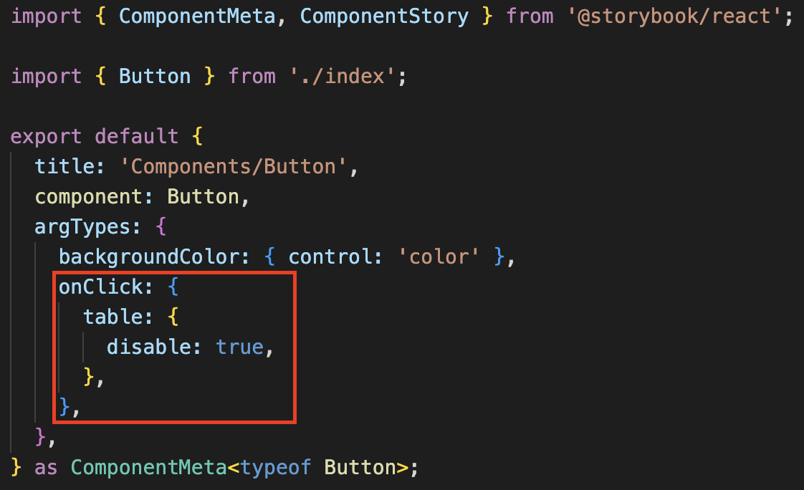

### Control

스토리북에서 props를 타입에 따라 컨트롤 할 수 있게 해줘 props 에 따라 해당 컴포넌트가 어떻게 변경되는지 확인할 수 있다.
<a href="https://storybook.js.org/docs/react/essentials/controls#annotation" target="_blank">스토리북 control 공식 문서</a>에서 다양한 타입의 control을 확인할 수 있다.

control에서 보이고 싶지 않는 props 들은 아래처럼 <b>argTypes</b>에 해당 props에서 `table: {disable: true}` 을 추가해주면 control table에서 보이지 않는다.

